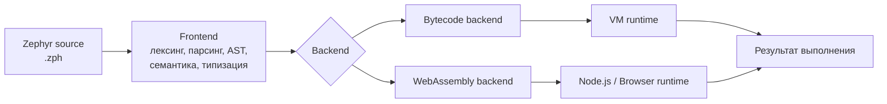

# Общий pipeline компиляции

```mermaid
flowchart LR
    Source["Zephyr source\n.zph"] --> Frontend["Frontend\nлексинг, парсинг, AST,\nсемантика, типизация"]
    Frontend --> Backend{"Backend"}
    Backend --> Bytecode["Bytecode backend"]
    Backend --> Wasm["WebAssembly backend"]
    Bytecode --> VM["VM runtime"]
    Wasm --> WasmRuntime["Node.js / Browser runtime"]
    VM --> Result["Результат выполнения"]
    WasmRuntime --> Result
```
