# Архитектура модулей проекта

```mermaid
flowchart TD
    Root["zephyr/"] --> Lexer["Lexer.ts"]
    Root --> Parser["parser/"]
    Root --> AST["ast/"]
    Root --> Semantics["semantics/"]
    Root --> Bytecode["bytecode/"]
    Root --> VM["vm/"]
    Root --> Wasm["wasm/"]
    Root --> Modules["modules/"]
    Root --> Diagnostics["diagnostics.ts"]
    Root --> Compiler["Compiler.ts"]

    Parser --> Grammar["grammar files"]
    Parser --> LalrGenerator["LalrGenerator"]
    Parser --> TableParser["TableParser"]
    Parser --> LalrAstParser["LalrAstParser"]

    Semantics --> Resolver["Resolver"]
    Semantics --> SemanticTypes["SemanticType"]
    Semantics --> Validator["Validator"]
    Semantics --> Validation["validation/"]

    Bytecode --> Emitters["emitters/"]
    Bytecode --> BytecodeGenerator["BytecodeGenerator"]
    Bytecode --> CompilerState["CompilerState"]

    Wasm --> WasmLowerer["WasmLowerer"]
    Wasm --> WasmIR["WasmIr"]
    Wasm --> WasmEmitter["WasmBinaryEmitter"]
    Wasm --> RuntimeHelpers["RuntimeHelpers"]
```



```
zephyr/
 ├─ parser/
 │   ├─ grammar
 │   ├─ LALR generator
 │   └─ AST parser
 ├─ ast/
 ├─ semantics/
 │   ├─ Resolver
 │   ├─ SemanticModel
 │   └─ Validator
 ├─ bytecode/
 │   ├─ emitters
 │   └─ BytecodeGenerator
 ├─ vm/
 ├─ wasm/
 │   ├─ Lowering
 │   ├─ Wasm IR
 │   └─ Binary Emitter
 ├─ modules/
 └─ diagnostics/
 ```