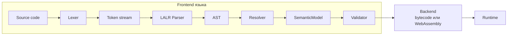
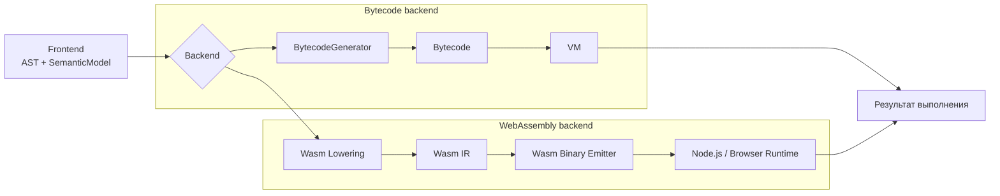

# Frontend и backend

## Детализация frontend

```mermaid
flowchart LR
    subgraph Frontend["Frontend языка"]
        Source["Source code"] --> Lexer["Lexer"]
        Lexer --> Tokens["Token stream"]
        Tokens --> Parser["LALR Parser"]
        Parser --> AST["AST"]
        AST --> Resolver["Resolver"]
        Resolver --> SemanticModel["SemanticModel"]
        SemanticModel --> Validator["Validator"]
    end

    Validator --> Backend["Backend\nbytecode или WebAssembly"]
    Backend --> Runtime["Runtime"]
```

## Детализация backend

```mermaid
flowchart LR
    Frontend["Frontend\nAST + SemanticModel"] --> Backend{"Backend"}

    subgraph BytecodeBackend["Bytecode backend"]
        Backend --> BytecodeGenerator["BytecodeGenerator"]
        BytecodeGenerator --> Bytecode["Bytecode"]
        Bytecode --> VM["VM"]
    end

    subgraph WasmBackend["WebAssembly backend"]
        Backend --> WasmLowering["Wasm Lowering"]
        WasmLowering --> WasmIR["Wasm IR"]
        WasmIR --> WasmEmitter["Wasm Binary Emitter"]
        WasmEmitter --> WasmRuntime["Node.js / Browser Runtime"]
    end

    VM --> Result["Результат выполнения"]
    WasmRuntime --> Result
```
