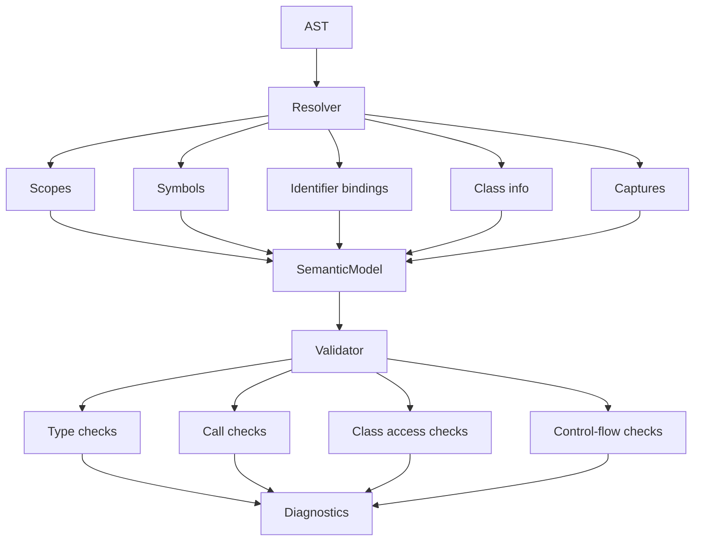

# Семантический анализ

```mermaid
flowchart TD
    AST["AST"] --> Resolver["Resolver"]

    Resolver --> Scopes["Scopes"]
    Resolver --> Symbols["Symbols"]
    Resolver --> Bindings["Identifier bindings"]
    Resolver --> Classes["Class info"]
    Resolver --> Captures["Captures"]

    Scopes --> SemanticModel["SemanticModel"]
    Symbols --> SemanticModel
    Bindings --> SemanticModel
    Classes --> SemanticModel
    Captures --> SemanticModel

    SemanticModel --> Validator["Validator"]
    Validator --> TypeChecks["Type checks"]
    Validator --> CallChecks["Call checks"]
    Validator --> ClassChecks["Class access checks"]
    Validator --> FlowChecks["Control-flow checks"]

    TypeChecks --> Diagnostics["Diagnostics"]
    CallChecks --> Diagnostics
    ClassChecks --> Diagnostics
    FlowChecks --> Diagnostics
```
