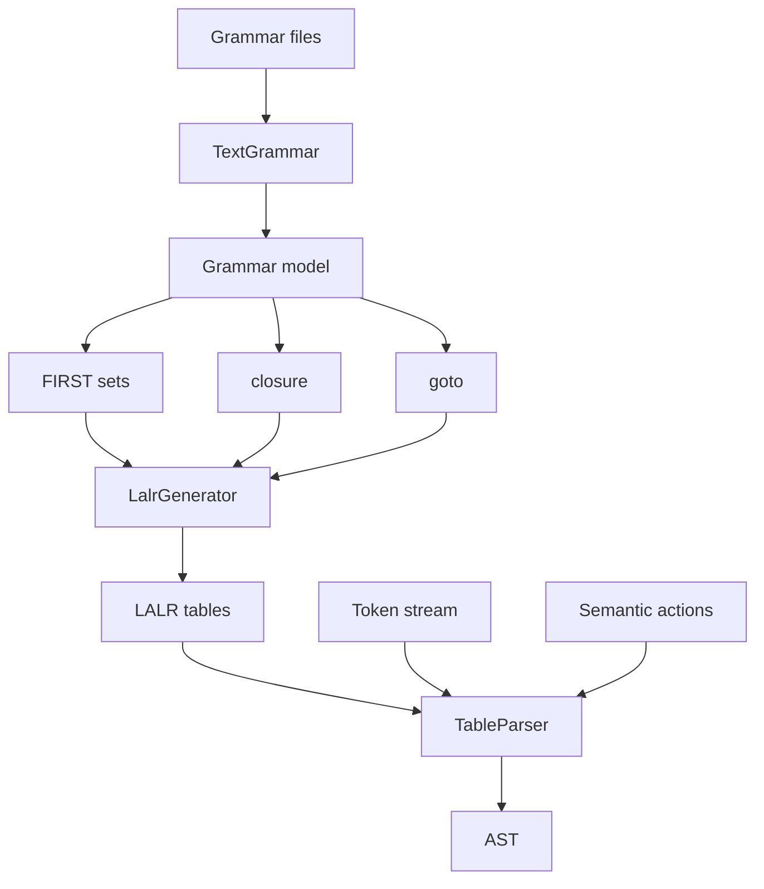

# LALR-парсер

```mermaid
flowchart TD
    GrammarFiles["Grammar files"] --> TextGrammar["TextGrammar"]
    TextGrammar --> GrammarModel["Grammar model"]
    GrammarModel --> FirstSets["FIRST sets"]
    GrammarModel --> Closure["closure"]
    GrammarModel --> Goto["goto"]
    FirstSets --> LalrGenerator["LalrGenerator"]
    Closure --> LalrGenerator
    Goto --> LalrGenerator
    LalrGenerator --> Tables["LALR tables"]
    Tables --> TableParser["TableParser"]
    Tokens["Token stream"] --> TableParser
    SemanticActions["Semantic actions"] --> TableParser
    TableParser --> AST["AST"]
```
