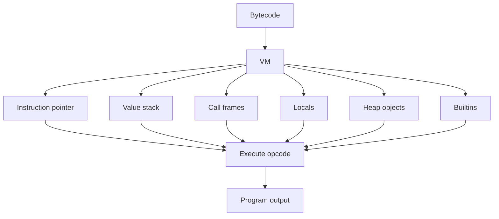

# Выполнение bytecode в VM

```mermaid
flowchart TD
    Bytecode["Bytecode"] --> VM["VM"]

    VM --> IP["Instruction pointer"]
    VM --> Stack["Value stack"]
    VM --> Frames["Call frames"]
    VM --> Locals["Locals"]
    VM --> Heap["Heap objects"]
    VM --> Builtins["Builtins"]

    IP --> Execute["Execute opcode"]
    Stack --> Execute
    Frames --> Execute
    Locals --> Execute
    Heap --> Execute
    Builtins --> Execute

    Execute --> Output["Program output"]
```
