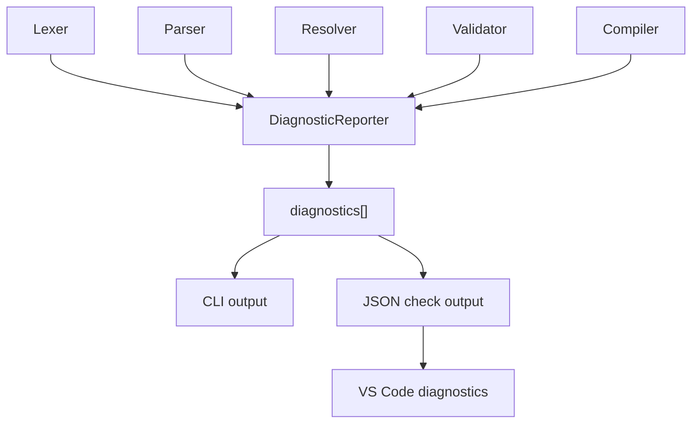

# Диагностика ошибок

```mermaid
flowchart TD
    Lexer["Lexer"] --> Reporter["DiagnosticReporter"]
    Parser["Parser"] --> Reporter
    Resolver["Resolver"] --> Reporter
    Validator["Validator"] --> Reporter
    Compiler["Compiler"] --> Reporter

    Reporter --> Diagnostics["diagnostics[]"]
    Diagnostics --> CLI["CLI output"]
    Diagnostics --> JSON["JSON check output"]
    JSON --> VSCode["VS Code diagnostics"]
```
